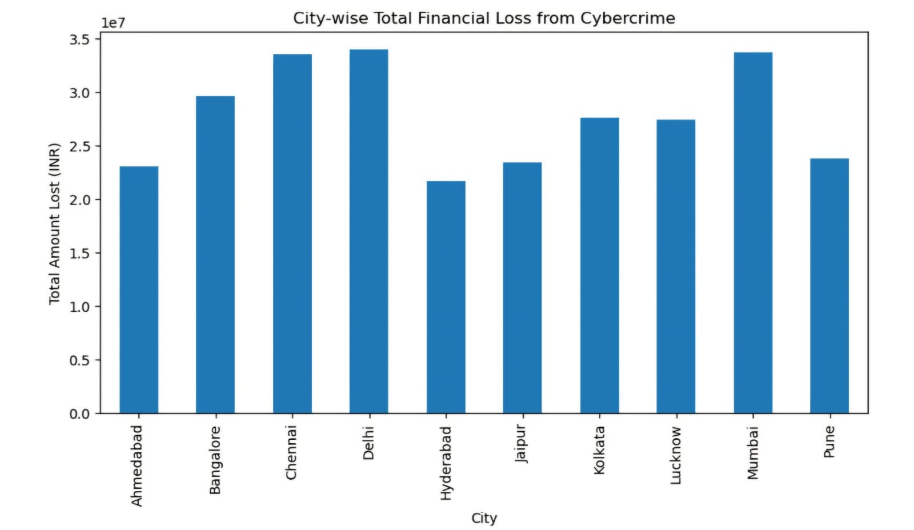
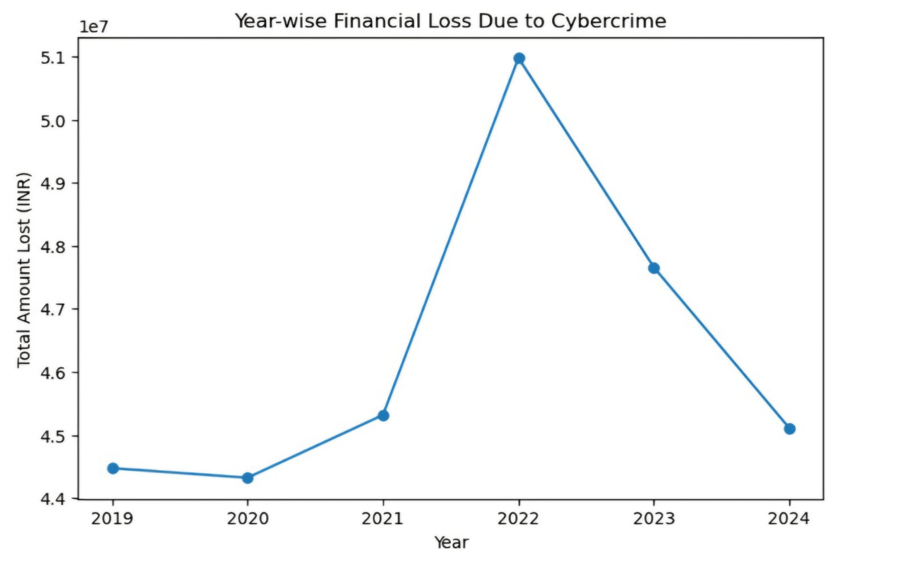
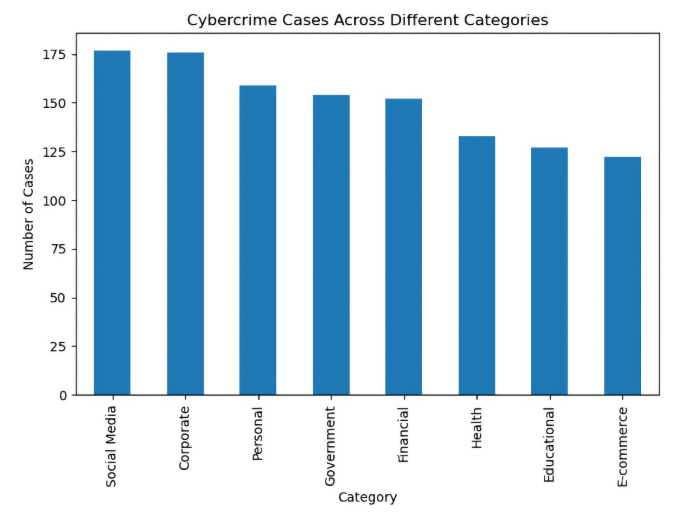
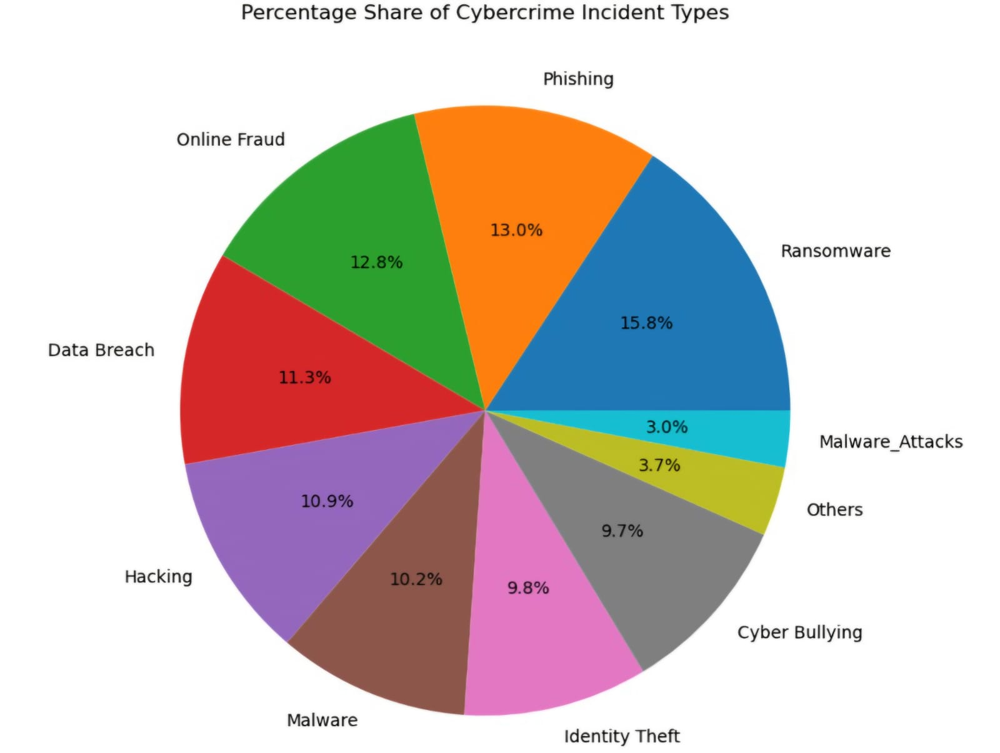
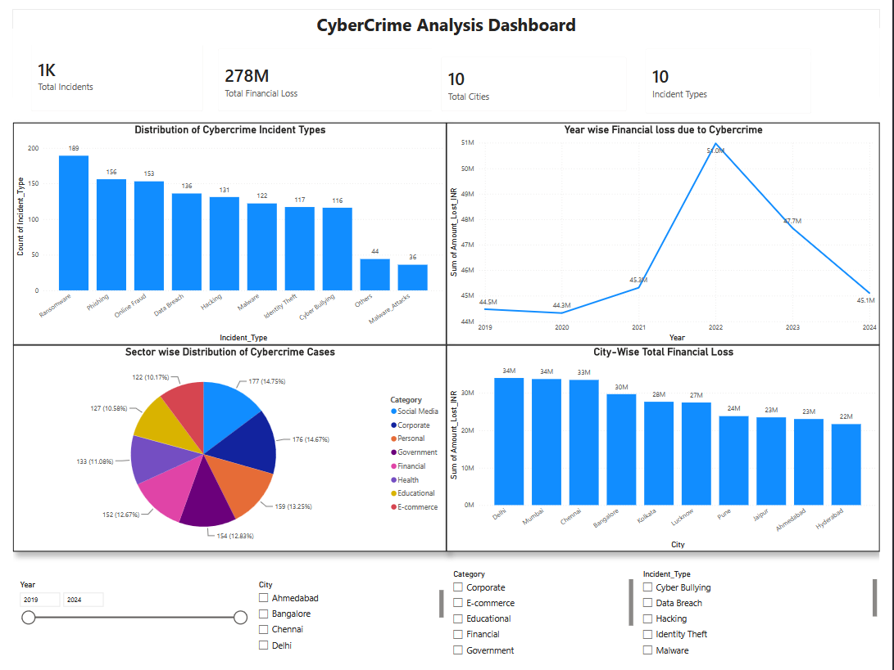
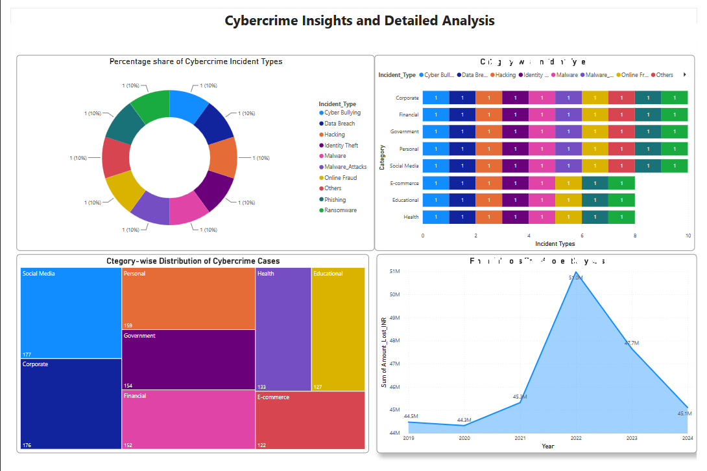

<h1 align="center">🛡️ Cybercrime Analysis: Digital Fraud & Cybercrime Trends</h1>

<p align="center">
<b>An End-to-End Data Analytics Project using Python, Jupyter Notebook, Power BI, and DAX</b>
</p>

<p align="center">


</p>

<hr>

<h2>🌟 Project Overview</h2>

<p align="justify">

Cybercrime has become one of the fastest-growing digital threats worldwide, causing significant financial losses to individuals, organizations, and governments.

This project presents an end-to-end data analytics workflow where cybercrime data is first cleaned, analyzed, and visualized using Python in Jupyter Notebook. The processed dataset is then transformed into an interactive Power BI dashboard that enables dynamic business intelligence reporting using KPI cards, DAX measures, interactive charts, and slicers.

The objective is to uncover hidden patterns, identify cybercrime trends, evaluate financial losses, compare categories, and generate meaningful insights through both exploratory data analysis and business intelligence visualization.

</p>

<hr>

<h2>🎯 Project Objectives</h2>

<ul>

<li>Analyze cybercrime incidents and fraud patterns.</li>

<li>Perform data cleaning and preprocessing.</li>

<li>Handle missing values.</li>

<li>Conduct Exploratory Data Analysis (EDA).</li>

<li>Identify yearly cybercrime trends.</li>

<li>Evaluate financial losses.</li>

<li>Compare incident categories.</li>

<li>Develop an interactive Power BI dashboard.</li>

<li>Create KPI cards using DAX.</li>

<li>Generate business insights through visualization.</li>

</ul>

<hr>

<h2>🛠️ Technology Stack</h2>

<ul>

<li>Python</li>

<li>Jupyter Notebook</li>

<li>Pandas</li>

<li>NumPy</li>

<li>Matplotlib</li>

<li>Seaborn</li>

<li>Power BI Desktop</li>

<li>DAX (Data Analysis Expressions)</li>

<li>CSV Dataset</li>

<li>Git & GitHub</li>

</ul>

<hr>

<h2>📂 Dataset Features</h2>

<table>

<tr>

<th>Feature</th>

<th>Description</th>

</tr>

<tr>

<td>Year</td>

<td>Year of the cybercrime incident</td>

</tr>

<tr>

<td>Day</td>

<td>Day of occurrence</td>

</tr>

<tr>

<td>Amount Lost (INR)</td>

<td>Financial loss reported</td>

</tr>

<tr>

<td>Incident Type</td>

<td>Type of cybercrime incident</td>

</tr>

<tr>

<td>Category</td>

<td>Cybercrime category</td>

</tr>

<tr>

<td>City</td>

<td>City where the incident occurred</td>

</tr>

</table>

<hr>

<h2>🐍 Python Data Analysis (Jupyter Notebook)</h2>

<p align="justify">

The first phase of this project focuses on cleaning, preprocessing, and analyzing the cybercrime dataset using Python. Exploratory Data Analysis (EDA) was performed to discover hidden trends, understand financial losses, compare cybercrime categories, and generate meaningful visualizations before building the Power BI dashboard.

</p>

<hr>

<h2>📊 Analysis Performed</h2>

<ul>

<li>Data Cleaning and Preprocessing</li>

<li>Handling Missing Values</li>

<li>Exploratory Data Analysis (EDA)</li>

<li>Trend Analysis</li>

<li>Financial Loss Analysis</li>

<li>Category-wise Incident Analysis</li>

<li>Data Visualization</li>

<li>Insight Generation</li>

</ul>

<hr>

<h2>📸 Python Visualizations</h2>

<h3>🏙️ City-wise Financial Loss from Cybercrime</h3>

<p align="center">



</p>

<p align="justify">

This visualization compares financial losses across different city categories, highlighting the cities that experience the highest economic impact due to cybercrime.

</p>

<br>

<h3>📈 Year-wise Financial Loss Due to Cybercrime</h3>

<p align="center">



</p>

<p align="justify">

This chart illustrates financial loss trends over multiple years and helps identify periods with significant increases or decreases in cybercrime-related losses.

</p>

<br>

<h3>🛡️ Cybercrime Cases Across Different Categories</h3>

<p align="center">



</p>

<p align="justify">

This visualization compares the distribution of cybercrime incidents across different categories, making it easier to identify the most common cybercrime types.

</p>

<br>

<h3>🥧 Percentage Share of Cybercrime Incident Types</h3>

<p align="center">



</p>

<p align="justify">

This visualization presents the percentage contribution of each cybercrime incident type to the total number of reported cases.

</p>

<hr>
<h2>📊 Power BI Dashboard</h2>

<p align="justify">

After completing the Exploratory Data Analysis (EDA) in Jupyter Notebook, the cleaned dataset was imported into <b>Power BI Desktop</b> to create an interactive business intelligence dashboard. The dashboard enables users to explore cybercrime trends, financial losses, and incident patterns through interactive charts, KPI cards, DAX measures, and slicers. It provides a user-friendly interface for dynamic analysis and data-driven decision-making.

</p>

<hr>

<h2>✨ Dashboard Features</h2>

<ul>

<li>📊 Four KPI Cards
    <ul>
        <li>Total Incidents</li>
        <li>Total Financial Loss</li>
        <li>Total Cities</li>
        <li>Total Incident Types</li>
    </ul>
</li>

<li>📈 Eight Interactive Visualizations</li>

<li>📄 Two Dashboard Pages</li>

<li>🎯 DAX Measures for KPI Calculations</li>

<li>🎛️ Interactive Slicers
    <ul>
        <li>Year</li>
        <li>City</li>
        <li>Category</li>
        <li>Incident Type</li>
    </ul>
</li>

<li>📊 Interactive Business Intelligence Reporting</li>

</ul>

<hr>

<h2>📸 Power BI Dashboard Preview</h2>

<h3>📄 Dashboard - Page 1 (Executive Dashboard)</h3>

<p align="center">



</p>

<p align="justify">

The Executive Dashboard provides a high-level summary of cybercrime incidents through KPI cards and interactive visualizations. Users can quickly analyze incident distribution, yearly financial losses, city-wise losses, and category-wise trends while filtering the data using slicers.

</p>

<br>

<h3>📄 Dashboard - Page 2 (Detailed Analysis)</h3>

<p align="center">



</p>

<p align="justify">

The Detailed Analysis page offers deeper insights using advanced visualizations such as donut charts, treemaps, stacked bar charts, and area charts. These visuals help users compare cybercrime categories, understand incident distributions, and identify financial loss trends.

</p>

<hr>

<h2>📊 Dashboard Visualizations</h2>

| Visualization | Description |
|--------------|-------------|
| KPI Cards | Display Total Incidents, Total Financial Loss, Total Cities, and Total Incident Types. |
| Clustered Column Chart | Distribution of Cybercrime Incident Types |
| Line Chart | Year-wise Financial Loss Due to Cybercrime |
| Pie Chart | Sector-wise Distribution of Cybercrime Cases |
| Clustered Bar Chart | City-wise Total Financial Loss |
| Donut Chart | Percentage Share of Cybercrime Incident Types |
| Treemap | Category-wise Distribution of Cybercrime Cases |
| Stacked Bar Chart | Category-wise Incident Types |
| Area Chart | Financial Loss Trend Over the Years |

<hr>

<h2>🔍 Key Findings</h2>

<ul>

<li>Cybercrime incidents show noticeable variation across different years.</li>

<li>Financial losses differ significantly depending on the type of cybercrime.</li>

<li>Certain cities experience higher cybercrime-related financial losses than others.</li>

<li>Some cybercrime categories contribute a larger share of total reported incidents.</li>

<li>The interactive Power BI dashboard enables dynamic exploration using slicers and filters.</li>

<li>Combining Python analysis with Power BI visualization provides a complete end-to-end analytics solution.</li>

</ul>

<hr>

<h2>📁 Repository Structure</h2>

```text
Cybercrime-Analysis/
│
├── Cybercrime_Analysis.ipynb
├── Cybercrime Dashboard.pbix
├── Cybercrime_Dashboard.pdf
├── cybercrime_data.csv
├── README.md
│
└── screenshots/
    ├── citywise_financial_loss.jpeg
    ├── yearwise_financial_loss.jpeg
    ├── cybercrime_categories.jpeg
    ├── incident_type_percentage.jpeg
    ├── dashboard_1.png
    └── dashboard_2.png

```
<hr>

<h2>🚀 Future Enhancements</h2>

<ul>

<li>Machine Learning-Based Fraud Prediction</li>

<li>Real-Time Cybercrime Dashboard</li>

<li>SQL Database Integration</li>

<li>Automatic Data Refresh</li>

<li>Advanced Statistical Analysis</li>

<li>Predictive Risk Assessment</li>

</ul>

<hr>

<h2>🎓 Learning Outcomes</h2>

<ul>

<li>Data Cleaning and Preprocessing</li>

<li>Exploratory Data Analysis (EDA)</li>

<li>Python Programming for Data Analysis</li>

<li>Data Visualization Techniques</li>

<li>Power BI Dashboard Development</li>

<li>DAX Measure Creation</li>

<li>KPI Design</li>

<li>Business Intelligence Reporting</li>

<li>Interactive Dashboard Development</li>

<li>Data Storytelling and Insight Generation</li>

<li>Git & GitHub Project Management</li>

</ul>

<hr>

<h2>📌 Conclusion</h2>

<p align="justify">

This project demonstrates a complete end-to-end data analytics workflow, beginning with data preprocessing and exploratory data analysis in Python and culminating in an interactive Power BI dashboard. By combining Python for analytical processing and Power BI for business intelligence, the project transforms raw cybercrime data into meaningful insights that support informed decision-making. It showcases practical skills in data analysis, dashboard development, visualization, DAX, and business intelligence reporting.

</p>

<hr>

<h2>👨‍💻 Author</h2>

<p>

<b>Baladithya Muthireddy</b><br>

Aspiring Data Analyst | Power BI | Python | SQL | Cybersecurity Enthusiast

</p>

<hr>

<h2>⭐ Support</h2>

<p align="justify">

If you found this project useful, please consider giving this repository a <b>⭐ Star</b>. Your support is greatly appreciated and motivates further improvements and future open-source projects.

</p>
